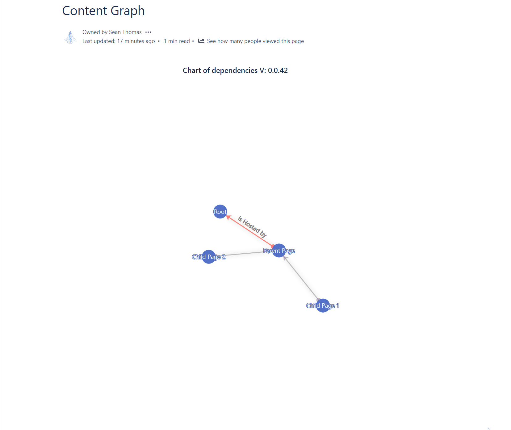
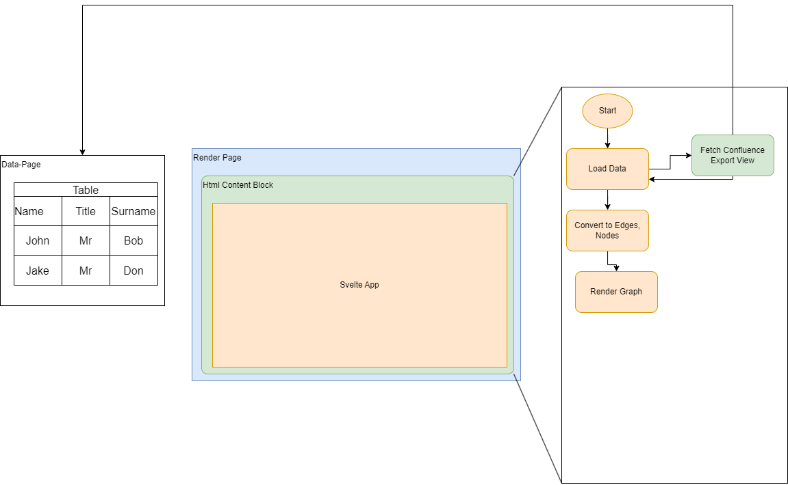
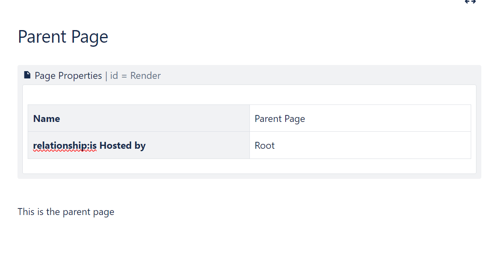
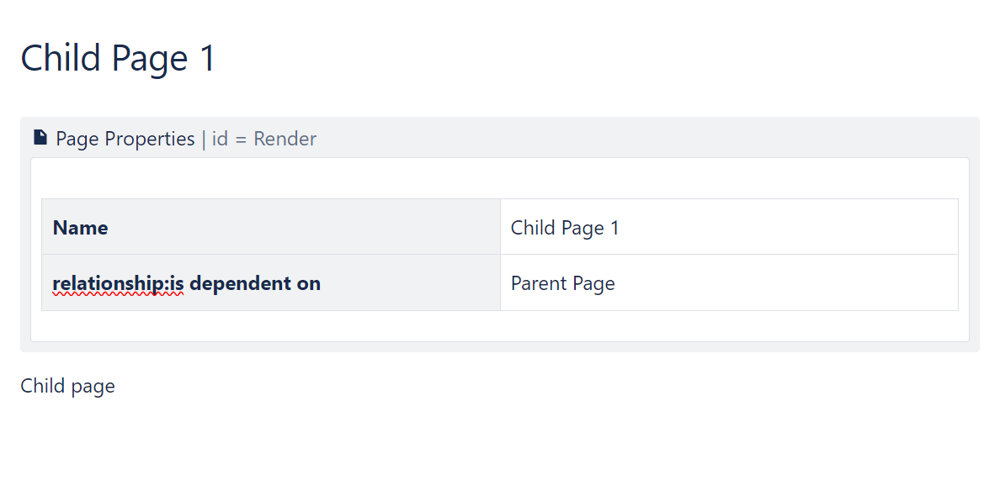
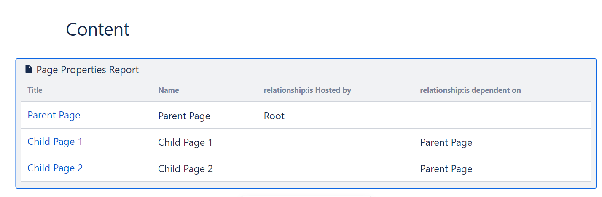
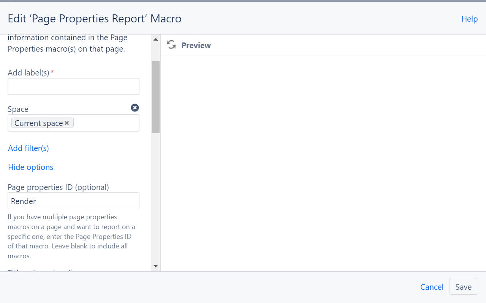

## You want to render a chart, using data from Confluence pages

> Or you want to add interactivity to a picture

Example:

## How the above page works

Create an app that calls the window fuction: fetchConfluence

## The data 

### Create a page with: Page Properties with a table

> Note the id field, needs to be set the same across all

### Create child page

> Note the id field, needs to be set the same across all

### Create an Index page
With Page Properties Report

 Note the id field, needs to be set the same across all

- Change the max rows to the amount of pages you have

## The app

You can create an HTML app that produces a single Html file containing all that it needs to run

(Svelte + Vite template does this quite well)

### To get the data

See the example fetch call that returns the table as HTML

[See Example Fetch](FetchCalls.html)

> From here it is up to you to build an app

Refer to the Repo for example how this works
