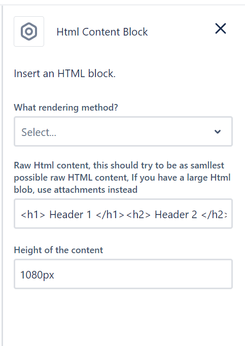
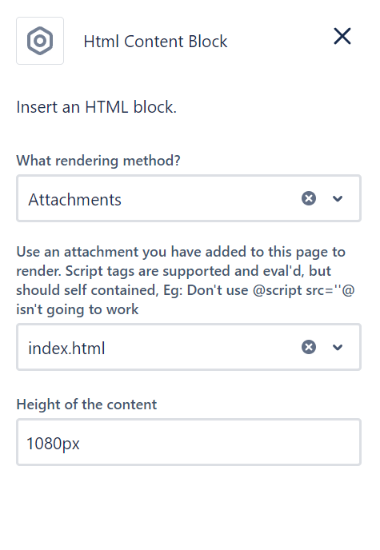

## Raw Html

If you provide raw Html to the config panel, 

It will set the content to the `Div`



> Note: A textbox has limited space, use Attachment if you have alot of Html

## Attachment Html

If you provide a singular Html file to load, 

The plugin will set the `Div` content to your attached file



## Height

Set the max height your content should render at, 

Defaulting to : 1080px

> Note: Don't user View-Height unit, Confluence + View-Height unit, goes strange

## Limits

Confluence does not allow direct access to files/endpoints

You can call other endpoints, but the CSP content rules will be applied

## Fetching data from Confluence

If you want to fetch the export view of a Confluence page call:

```
const tablePageContentId = "7831683"
const data = await window.fetchConfluence(tablePageContentId)
body = data.body.export_view.value; 

// returns html content that the page would of rendered
```
[See Example Fetch](FetchCalls.html)
